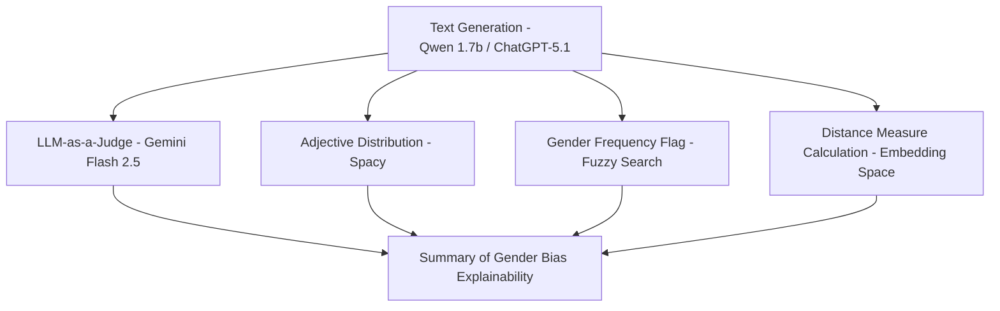

# Profession Description Bias Analysis


This project analyzes how a Large Language Model (LLM) — specifically Qwen 1.7B running locally via Ollama — describes individuals in a given profession when asked using multiple prompt variations. The goal is to evaluate potential **gender bias** and **stereotypical framing** using NLP-based explainability methods.


The pipeline evaluates fairness and explainability by examining:
- How descriptive language varies across prompts
- How frequently gendered or neutral descriptions appear
- What adjectives dominate across generated samples
- Semantic differences between gendered vs. non-gendered descriptions 
- Independent judgment via LLM-as-a-Judge


---

## 📦 Pipeline Structure



**Generation phase (`gen_sentence.py`):**
1. Generates open-ended descriptions of a given `PROFESSION` using multiple prompt variants.
2. Extracts **adjectives** in the responses → used to study dominant traits and build a word cloud.
3. Detects **gender references** → counts occurrences of male / female / non-gender descriptions.

**Embedding analysis (`embeddings.py`, `embedding_post_processing.ipynb`):**

4. Computes description similarity between gendered and non-gendered responses to produce a disparity score. 
   Additionally, calculate the centroid and radius of embeddings for each gender_label subgroup and visualize the results.

**Bias evaluation (`judge_llm.ipynb`):**

5. Applies LLM-as-a-Judge to compare sentences and evaluate potential stereotypical or biased framing.

---

## 📂 Folder Structure

The project's directory structure is as follows:

```plaintext
LLM_Gender_fairness/
├── fairness-lens/             # Next.js Dashboard for visualizing results.
│   ├── src/                   # Source code for the frontend application.
│   ├── public/                # Static assets (including a copy of results).
│   └── package.json           # Frontend dependencies and scripts.
├── old_files/                 # Contains legacy scripts for generating and analyzing responses.
│   ├── main.py
│   ├── main_2.py
│   └── main_3.py
├── results/                   # Stores output files and analysis results.
│   ├── data/
│   │   ├── (*)_gender_freq.csv                               #Most common gender used
│   │   ├── (*)_adjectives_freq.csv                           #Most common adjective used on description
│   │   ├── (*)_judge_scores.csv                              #LLMs scores by sample
│   │   ├── (*)_final_bias_summary.json                       #LLM final evaluation of the sentence
│   │   └── embeddings/all_professions_with_gender_scores.csv #Paragraph distance measure between gender
│   └── wordcloud/                                            #Generated word cloud images for professions
├── gen_sentence.py                  # Script for generating descriptions of professions.
├── embeddings.py                    # Script for embedding similarity analysis.
├── generate_circles.py              # Script to generate visualization coordinates.
├── embedding_post_processing.ipynb  # Notebook for processing and visualizing embeddings output.
├── judge_llm.ipynb                  # Notebook to evaluate bias based on LLM-generated text.
└── README.md                        # Documentation file (this file).
```

---
## 🔧 How to Extend the Pipeline

This pipeline is adaptable and can be repurposed for other fairness and bias evaluations. Parameters and keywords such as the `SYSTEM` prompt, `QUESTIONS`, `PROFESSION`, and gender detection vocabularies can all be modified to suit new research objectives.

---

## 🛠 Installation & Setup

Ensure to follow these steps to set up the pipeline and dependencies:

### 1) Clone the Repository

```bash
git clone https://github.com/der41/LLM_Gender_fairness.git
cd LLM_Gender_fairness
```

### 2) Create and Activate a Virtual Environment

For macOS/Linux:
```bash
python3 -m venv venv
source venv/bin/activate
```

For Windows:
```bash
python3 -m venv venv
venv\Scripts\activate
```

### 3) Install the Required Packages

Install the dependencies listed in `requirements.txt` or manually ensure that all necessary Python packages are installed.

---

## Prerequisite: Running Ollama

Ensure that you have Ollama installed and configured locally. You can download the specific model using the following command:

```bash
ollama pull qwen3:1.7b
```

This ensures that the Qwen 1.7B model is available for executing the pipeline.

---

## 📊 Run the Dashboard (Fairness Lens)

This project includes a **Next.js** web application ("Fairness Lens") to visualize the analysis results, explore word clouds, and view the gender bias metrics interactively.

### 1) Prerequisites
Ensure you have [Node.js](https://nodejs.org/) installed on your machine (version 18+ recommended).

### 2) Navigate to the Dashboard
The dashboard code is located in the `fairness-lens` subdirectory.

```bash
cd fairness-lens
```

### 3) Install dependencies

```bash
npm install
# or if you use yarn:
# yarn install
```

### 4) Start the Development Server
Run the local server:

```bash
npm run dev
```
### 5) Access the Interface
Open your web browser and navigate to:
**[http://localhost:3000](http://localhost:3000)**

> **Note:** The dashboard is designed to read the analysis output (CSVs, JSONs, and images) directly from the `public/results/` directory. If you run the Python pipeline, ensure the generated files are placed there to see updated data in the UI.

---
## 💡 Contribution Guide

Contributions are welcome! If you have ideas, bug reports, or suggestions for improvement, please feel free to fork the repository and submit a pull request.

Steps:
1. Fork the repository.
2. Create a new branch: `git checkout -b feature-name`.
3. Make and test your changes.
4. Submit a pull request.

---

## ⚖️ License

This project is licensed under the [MIT License](LICENSE). You are free to use, distribute, and modify this code under the terms of the license.

---

## 📧 Contact

For any questions, clarifications, or issues, feel free to raise an issue in the repository or contact the maintainer via GitHub.

---

## Future Directions

- Integrate additional analysis modules to further explainability.
- Expand the diversity of profession prompts.
- Evaluate fairness with respect to intersections of other identities (e.g., race, age).

Through these advancements, this project can continue to evolve as a benchmark tool for bias analysis in natural language generation.
